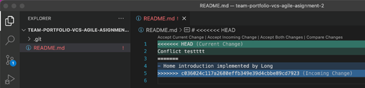
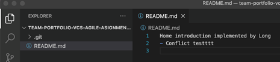
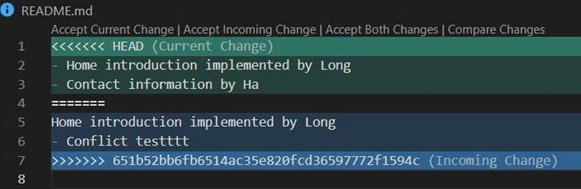
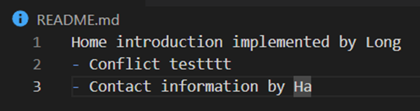

## Conflict Report

Trong quá trình thực hiện Assignment 2, nhóm đã gặp phải xung đột dạng “Many-to-One” khi tất cả các thành viên cùng chỉnh sửa trên cùng một file README.md.

Long là người tạo Pull Request và thực hiện merge đầu tiên vào nhánh main nên không gặp xung đột.

Ngọc và Hà gặp lỗi merge conflict khi thực hiện merge Pull Request của mình do các thay đổi trùng nhau trong file README.md.

Đối với Ngọc:
- Thực hiện pull các thay đổi mới nhất từ nhánh main về nhánh làm việc của mình.
- Git phát hiện xung đột do cả hai nhánh cùng chỉnh sửa nội dung trong README.md.
- Xung đột được xử lý cục bộ bằng cách chỉnh sửa thủ công file bị conflict thông qua Merge Editor của VS Code.
- Sau khi hoàn tất chỉnh sửa, Ngọc commit và push lại các thay đổi đã được giải quyết.
- Pull Request sau đó được merge thành công vào nhánh main.

Đối với Hà:
- Thực hiện pull các thay đổi mới nhất từ nhánh main về nhánh làm việc của mình.
- Git phát hiện merge conflict do trùng lặp nội dung chỉnh sửa trong README.md.
- Hà xử lý xung đột bằng phương pháp chỉnh sửa thủ công thông qua Merge Editor của VS Code.
- Sau khi commit và push lại các thay đổi, Pull Request được merge vào nhánh main.

Nhóm đã sử dụng phương pháp Local Merge Resolution để giải quyết xung đột bằng cách kéo phiên bản mới nhất từ nhánh main và chỉnh sửa thủ công nhằm giữ lại tất cả các thay đổi hợp lệ trước khi commit và push lại.

## Giá trị của Code Review trong làm việc nhóm

- Phát hiện lỗi sớm: Giúp phát hiện bug, lỗi logic hoặc các trường hợp chưa xử lý trước khi mã nguồn được merge vào nhánh chính, từ đó giảm chi phí sửa lỗi về sau.
- Cải thiện chất lượng mã nguồn: Thông qua góp ý về cách viết code, đặt tên, cấu trúc và hiệu năng, mã nguồn trở nên rõ ràng, dễ đọc và dễ bảo trì hơn.
- Đảm bảo tuân thủ tiêu chuẩn chung: Code review giúp các thành viên tuân theo coding convention, kiến trúc và quy ước của dự án.
- Chia sẻ kiến thức trong nhóm: Các thành viên có cơ hội học hỏi kinh nghiệm và cách giải quyết vấn đề từ nhau.
- Giảm rủi ro phụ thuộc cá nhân: Khi nhiều người hiểu cùng một phần mã nguồn, dự án không bị phụ thuộc vào một cá nhân duy nhất.

## Vai trò của các sự kiện Agile

- Các buổi trao đổi ngắn hằng ngày (mini Daily Standup) giúp các thành viên cập nhật tiến độ công việc, nêu rõ những việc đã làm, đang làm và các khó khăn gặp phải.
- Nhờ Daily Standup, nhóm kịp thời điều chỉnh kế hoạch, phân công lại công việc khi cần và tránh tình trạng trùng lặp hoặc bỏ sót nhiệm vụ.
- Việc chia nhỏ công việc theo User Story và theo dõi trên Project Board giúp nhóm kiểm soát tiến độ một cách trực quan và minh bạch.
- Các sự kiện Agile giúp tăng cường giao tiếp giữa các thành viên, nâng cao tinh thần trách nhiệm cá nhân và sự phối hợp trong nhóm.
- Nhờ áp dụng Agile, nhóm duy trì được nhịp độ làm việc ổn định và hoàn thành Assignment đúng thời hạn.
